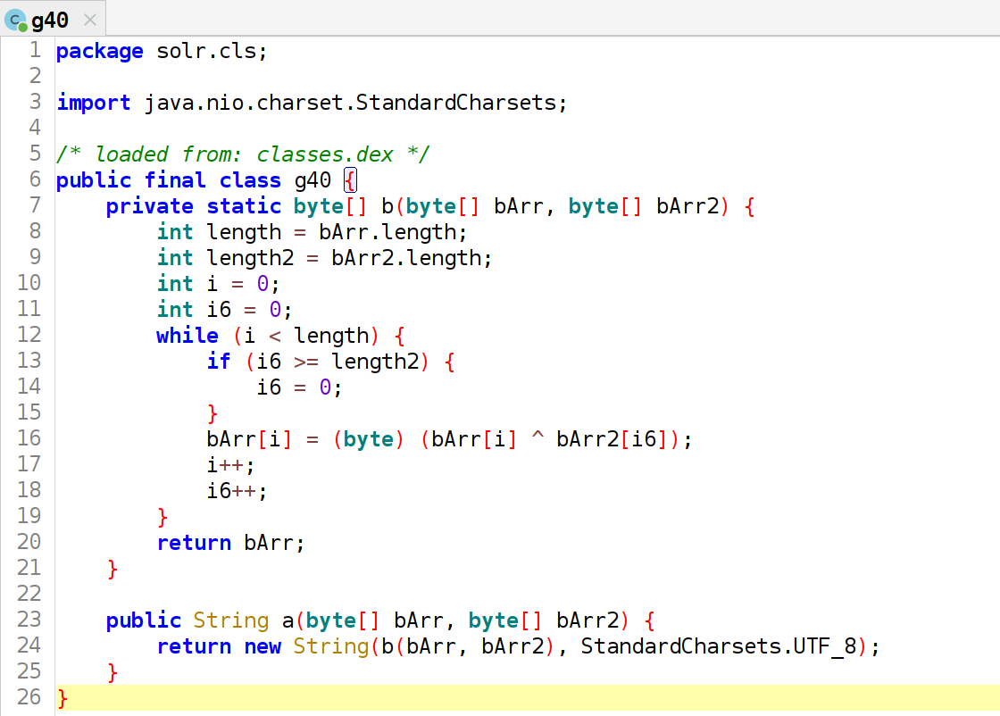
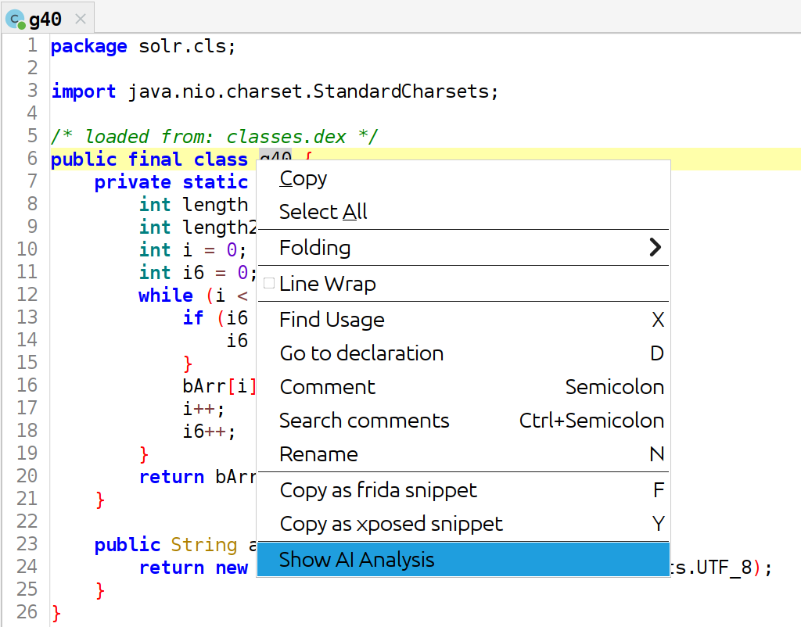
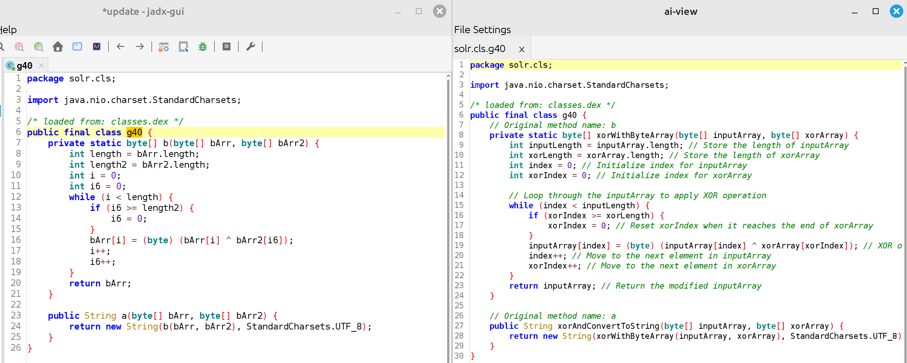

# Jadx AI view plugin
A (Work in progress) Jadx plugin that shows AI analysis of a method/class in a separate view allowing a reverse engineer to compare code and the AI analysis to understand it better. Currently supports gpt4free gpt 3.5 turbo, Gemini 1.5 flash and OpenAI GPT 4.0 mini.

## Usage
The following is a sample malware code from Jadx:<br/>


Right Click on the class or method name and select the "*Show AI Analysis*" option as seen below:<br/>


This opens up the jadx-ai-view window with the AI analysis output as seen below:<br/>


## Prerequisites
Install gpt4free if you plan on using the gpt4free option i.e:
```bash
python3 -m pip install g4f
```

## Building
Execute the following command to build the jar file:
```bash
`export VERSION='1.0.0' && ./gradlew build`
```
## Installation
Jadx > 1.5.0 is required, please install the latest version of the Jadx unstable build. Then browse to the `Plugins > Install plugin` option and enter `file:<Jadx AI View jar file path>` or enter the location id: `github:devilx86:jadx-ai-view-plugin`. Alternatively install with the following command:
```bash
 jadx-gui plugins --install "github:devilx86:jadx-ai-view-plugin"
```

## Credits
- Skylot - [Jadx](https://github.com/skylot/jadx), [plugin template and usage](https://github.com/skylot/jadx/wiki/Jadx-plugins-guide).
- [timschneeb](https://github.com/timschneeb/jadx-type-diagram-plugin) - Jadx API usage reference.
- [MartinKayJr](https://github.com/skylot/jadx/issues/1884#issue-1727047157) - Default prompt engineering.
- xtekky - [gpt4free](https://github.com/xtekky/gpt4free).
- LangChain4j - [LangChain4j](https://github.com/langchain4j/langchain4j/).
- bobbylight - [RSyntaxTextArea](https://github.com/bobbylight/RSyntaxTextArea).
